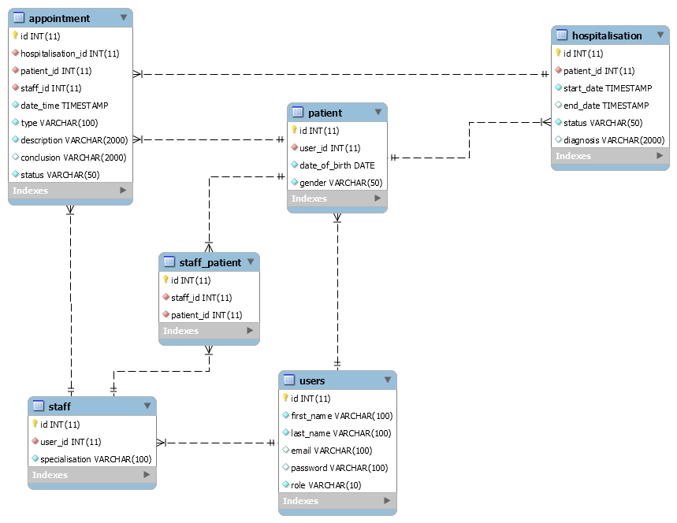

## Hospital

The task of the final project is to develop a web application that supports the functionality according to the
task variant.

### Variant

The system administrator has access to a list of doctors by category (pediatrician, traumatologist, surgeon, ...)
and a list of patients. Implement the ability to sort:

+ patients:
  - alphabetically;
  - by date of birth;
+ doctors: 
  - alphabetically;
  - by category;
  - by number of patients.

The administrator registers patients and doctors in the system and appoints a doctor to the patient. 

The doctor determines the diagnosis, makes appointments to the patient (procedures,medications, operations),
which are recorded in the Hospital Card. 

The appointment can be made by a Nurse (procedures, medications) or a Doctor (any appointment).
The patient can be discharged from the hospital, with a definitive diagnosis recorded.

(Optional: implement the ability to save / export a document with information about the patient's discharge).

#### Database schema

